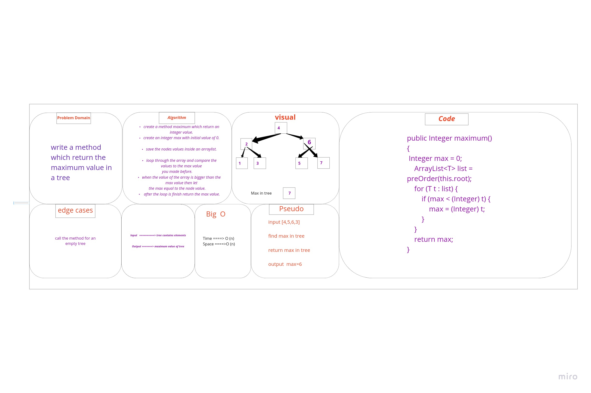

# Challenge Summary
write a method which return the maximum value in a tree.

## Whiteboard Process


## Approach & Efficiency
* time =O(n)
* space =O(n)
 because we used loops and we created an arraylist.

## Solution

Test code:

```
   BinarySearchTree<Integer> maxTest = new BinarySearchTree<>(5);
        maxTest.root.leftChild=new Node<>(8);
        maxTest.root.rightChild=new Node<>(10);
        maxTest.root.leftChild.leftChild=new Node<>(1);
        maxTest.root.leftChild.rightChild=new Node<>(3);

        System.out.println(maxTest.maximum());
```

output:

